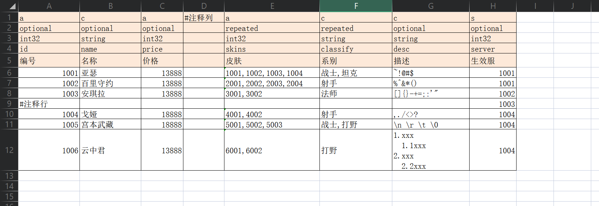

## excel2pb

一个简单高效的excel导表工具，xlsx => Google.Protobuf

### 特性

+ 支持解析.xlsx格式文件，导出对应的 proto、bytes、cs、json 数据
+ 支持差异化导出，每次仅导出变动过的数据，提高效率
+ 支持行注释、列注释


### 格式约定

表格前**5**行，分别为 字段作用域、字段规则、字段类型、字段名称、固定备注

+ 字段作用域：指定作用域，导出时配合 `--column-exclude` 使用
+ 字段规则：`optional repeated`
+ 字段类型：`double、float、int32、int64、uint32、uint64、sint32、sint64、fixed32、fixed64、sfixed32、sfixed64、bool、string` 
+ 字段名称：小驼峰式命名
+ 固定备注：备注行



### 基础用法

```
excel2pb.exe --input-dir ./xlsx
```

### 命令行参数

+ [**Required**] `--input-dir DIR` 指定Excel文件目录，目录下所有的 `.xlsx` 文件都将被解析

+ [Optional]  `--output-dir DIR` 指定导出数据目录，默认值等同于 `--input-dir`

+ [Optional]  `--force-rebuild` 是否重新导出数据，默认值为空 ，仅导出变动过的文件

+ [Optional]  `--proto-merge MERGED_NAME` 是否合并协议文件，默认不合并

+ [Optional]  `--package-name PACKAGE_NAME`  指定消息包名，默认值 `XlsxProtos`

+ [Optional]  `--column-exclude COLUMNS` 指定忽略的列，默认为空，如需忽略多个列则用 `|` 进行分割

+ [Optional]  `--table-prefix PREFIX` 导出的表前缀，默认值 `st_` (StaticTable)

+ [Optional]  `--descriptor_set_out` 是否导出proto文件描述集，默认不导出
